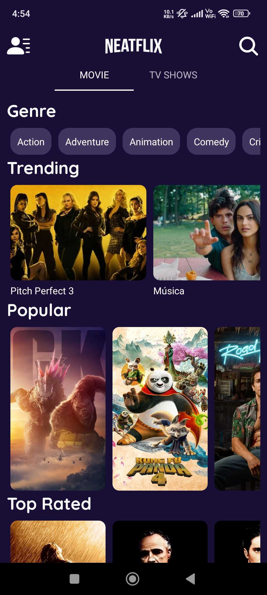

# NEATFLIX

An android app built using [Android Basic](https://developer.android.com/codelabs/build-your-first-android-app) that consumes [TMDB API](https://developers.themoviedb.org/3/getting-started/introduction) and [Apollo GraphQL](https://www.apollographql.com/docs/kotlin) to display the current trending, upcoming, top rated, and popular movies and tv-shows. It also suggests films based on your watch list.


---
# Setup Requirements
First, obtain your API key from [TMDB](https://developers.themoviedb.org/3/getting-started/introduction) and add it in a file named `apikey.properties` within the root directory:

```bash
YOUR_API_KEY="****"
```

Then, replace it in the `build.gradle(:app)` :

```bash
...
buildConfigField("String", "YOUR_API_KEY", apikeyProperties['YOUR_API_KEY'])
```

Finally, rebuild the project for changes to take effect and don't forget to update the references of this key in the `APIService.kt` file.

```bash
...
@Query("api_key") apiKey: String = BuildConfig.YOUR_API_KEY,
```

---
# Screenshots

  


---

For TMDB GraphQL :- [Github](https://github.com/priyanshu-banshisoft/tmdb_graphql) 

Happy coding!

